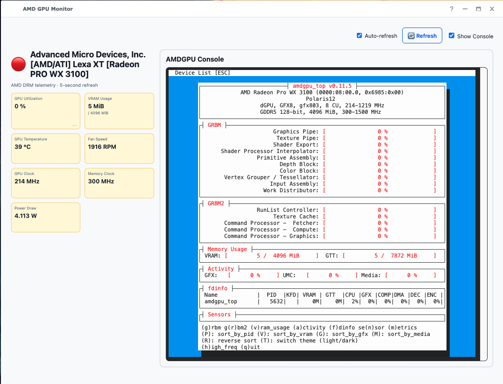
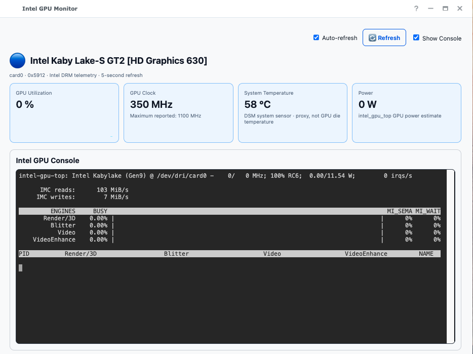

# Synology GPU Monitor

Read-only AMD, NVIDIA, and Intel GPU monitors for Synology DSM. Each package opens a floating DSM window with sensor cards and an optional **Show Console** view. Telemetry is collected on demand; no persistent polling daemon is required.

The screenshots below show the current tested UI. The SPK assets attached to older releases may not include every feature visible here.

Download all three current packages from the [unified GPU Monitors release](https://github.com/PeterSuh-Q3/syno-gpu-monitor/releases/tag/gpu-monitors-2026.09.24): AMD 0.4.3, NVIDIA 0.6.3, and Intel 0.3.1.

## AMD GPU Monitor

Shows AMD GPU utilization, VRAM, temperature, fan speed, clocks, and power when available. When the kernel omits VRAM sysfs values, the monitor can use the bundled `amdgpu_top` runtime as a fallback. The optional console displays `amdgpu_top`.

## NVIDIA GPU Monitor

Shows NVML-based GPU and VRAM utilization, NVENC/NVDEC activity, temperature, fan speed, and clocks. The optional console displays `nvidia-smi`.

## Intel GPU Monitor

Shows i915 GPU utilization and clock data. Power can fall back to the bundled `intel_gpu_top` runtime. If no GPU temperature sensor exists, the card is explicitly labelled **System Temperature** and uses DSM's system temperature as a proxy, not the GPU die temperature. The optional console displays `intel_gpu_top`.

## Repository layout

- `amd/` — AMD collector, DSM package, and build script
- `nvidia/` — NVIDIA collector, DSM package, and build script
- `intel/` — Intel collector, DSM package, and build script
- `common/` — shared console packaging and WebUI assets
- `docs/` — design notes, build guide, and screenshots

See the [GPU Console Integration Design](docs/gpu-console-integration-design.md) for the privilege and console lifecycle, and the [Docker Desktop Build Guide](docs/docker-desktop-build.md) for reproducible builds.
